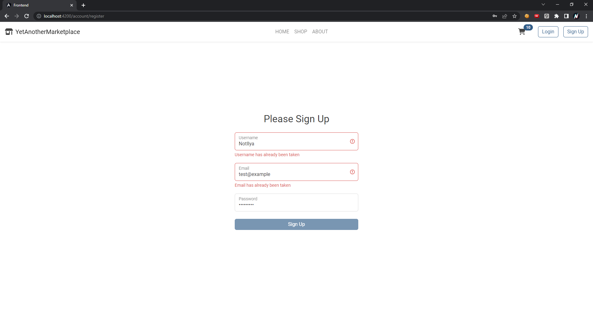

# YetAnotherMarketplace
This is a main repo of YetAnotherMarketplace project. YetAnotherMarketplace is a marketplace website currently it has only a few features: `Register and login`, `Basket linked to user`, `Products sorting and filtering`. This project has short [video overview](https://youtu.be/IczJgJISVK4).

## Screenshots
### Products main page


### Basket page


### Login/Register page


## Deploy
To deploy an app do following steps:
1. Run `git clone https://github.com/NotIlya4/YetAnotherMarketplace` or if you want to download all services source code run `git clone --recursive https://github.com/NotIlya4/YetAnotherMarketplace`.
2. Run `cd YetAnotherMarketplace`.
3. Write in console `docker-compose up`.

Now application fully deployed and you can navigate:
- `http://localhost:4200` Frontend.
- `http://localhost:5003/swagger/index.html` Gateway swagger docs.

## Frontend
Frontend is written using Angular. I tried to make it modular so i extracted some components to make them presentational components. It has several pages:
- `Shop` This is a products list page that contains sorting, filtering, searching and pagination for products.
- `Login/Register` This is just a login/register form.
- `Basket` This is a basket overview page. There you can increase, decrease or delete product from basket.

### CI/CD
Frontend repository has github actions workflow that publishes angular image to dockerhub.

## Backend
Backend consists of several REST API Services that work behind a gateway. Some transient or not very important data stores in redis (refresh tokens and user's baskets). All services contain unit and integration tests. Services:
- `Gateway` Generates request id and authorizes several endpoints.
- `AccountService` Authorizes users by jwt and refresh tokens.
- `BasketService` Manages baskets that bound to users.
- `ProductService` Provides products, brands and product types.

### Logging
Services use serilog + seq for logging. Gateway generates request id and propagates it when forwarding request in `x-request-id` header thus you can track logs for same request among services.

### CI/CD
Service repositories have github actions workflows for build application, run unit and integration tests and publish image to dockerhub.

### Authorization
Authorization is done by `AccountService` that utilize jwt and refresh tokens. Gateway expects jwt token in `Authorization` header.

### Swagger
You can observe shrink swagger documentation of each service in gateway swagger documentation at `http://localhost:5003/swagger/index.html`. Each service has its own swagger docs but services are not exposed by default. Before observing swagger docs of specific service you need to expose its port in docker-compose file. Example:
```
ports:
  - 5002:80
```

### Environment variables
All services contains folowing variables:
- `Serilog` You can override serilog configuration for any service.
- `AutoMigrate=true/false` Controls sql server migration on startup.
- `AutoSeed=true/false` Controls sql server seeding with sample data on startup.
